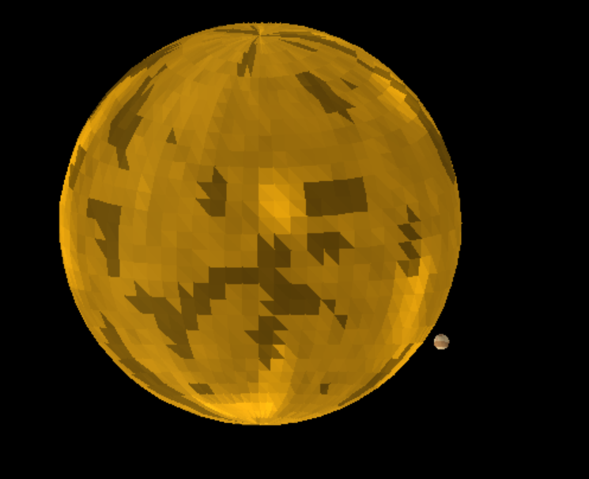
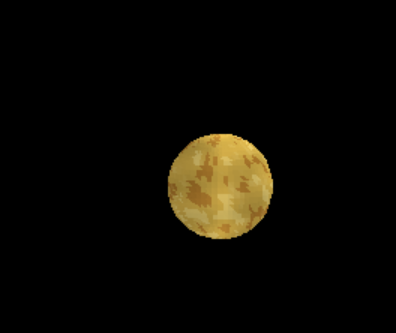
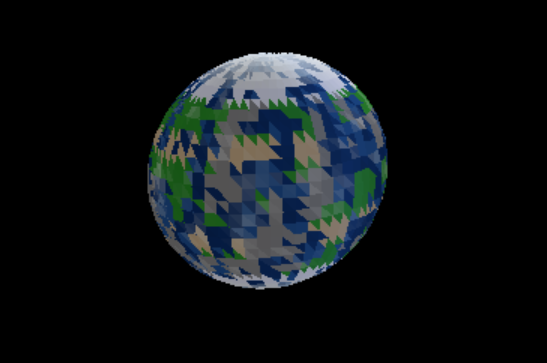
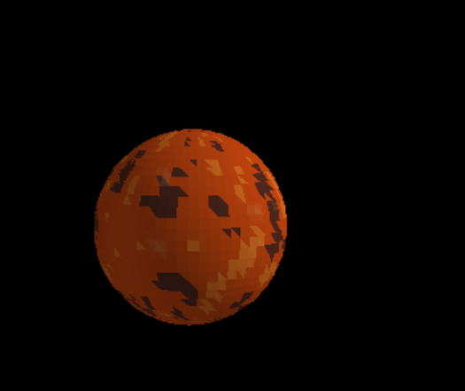
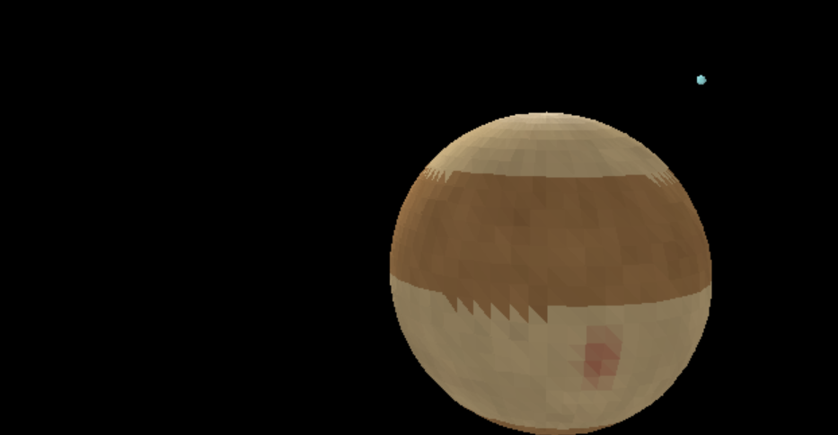
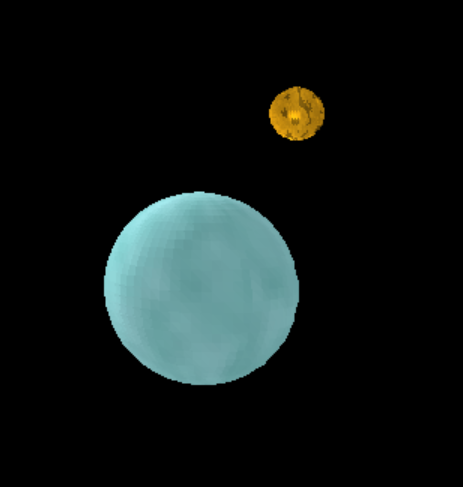
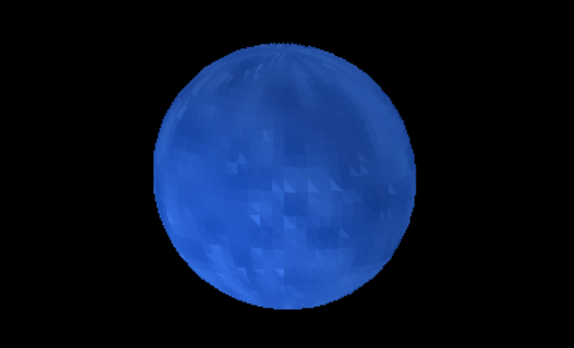

## Controles

### Movimiento de Cámara
- **W** - Mover cámara hacia adelante
- **S** - Mover cámara hacia atrás
- **A** - Mover cámara hacia la izquierda
- **D** - Mover cámara hacia la derecha
- **ESPACIO** - Mover cámara hacia arriba
- **SHIFT IZQUIERDO** - Mover cámara hacia abajo

### Rotación de Cámara
- **FLECHA IZQUIERDA** - Rotar cámara a la izquierda
- **FLECHA DERECHA** - Rotar cámara a la derecha
- **FLECHA ARRIBA** - Rotar cámara hacia arriba
- **FLECHA ABAJO** - Rotar cámara hacia abajo

### Salir
- **ESC** - Cerrar aplicación

## Planetas del Sistema Solar

### El Sol

### Venus

### Tierra y Luna

### Tierra

### Marte

### Júpiter

### Urano

### Neptuno

## Nave Espacial
